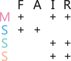

# Introduction 

## What is FAIR?

Research data often is stored on local hard drives, not well described or not formatted in a consistent and standard way. This makes it very difficult for others (and often even for the data owner themselves) to reuse the data or reproduce the research, because the data is not straightforward to understand, cannot be interpreted correctly, or, in case of local storage, might be unknown to others. In order to change this and increase the reusability of data, @Wilkinson_2016 introduced the FAIR concept together with 15 guiding principles providing guidance on how to implement it. FAIR stands for **F**indable, **A**ccessible, **I**nteroperable and **R**eusable, which more concrete means the following:

**Findable.** This means that the [metadata](#metadata) (and the data) can be easily found by humans and computers and that machine-readable metadata allows for automatic discovery of the data by machines.

**Accessible.** It is clearly stated how the user can access the data and whether, for example, authorisation or authentication are required.

**Interoperable.** In order to integrate the data with other data and to incorporate it into workflows or applications, the data needs to be fully compatible with other data. In easier words this means that data resources should 'speak the same language' to be used together.

**Reusable.** The ultimate goal of the FAIR concept is to make the data reusable, which means that there is proper annotation in the form of metadata that allows users (and machines) to understand the data and correctly interpret it.

## Extending FAIR

In our guide we will extend FAIR as it would be strictly defined by the FAIR principles in order to make it workable in practice. This means that we also include the component of structuring your data into the process of FAIRifying it.

**Structured.** Structuring your data, so organising it in a tidy way, can clearly make the data easier to access for others and enhances its understandability. We therefore think that this is a crucial component of increasing the reusability of your data.

## FAIR is not open

It is important to stress here that FAIR is **not equal** to open. While the metadata of your data should be openly available, informing others about the existence of your data, the data itself does not have to be open. If you have reasons for not making the data openly available to everyone (e.g., because it contains sensitive information), this can and should be made clear in the metadata where according licensing information and access rights can be provided. As long as this is guaranteed, restricted or closed data can also be completely FAIR.

## Why should your data be FAIR?

Depending on the current maturity of your data, making data FAIR certainly requires some effort, but the benefits are evident both for yourself and for others. Findable and well annotated data facilitates your own reuse of your data in the future and the reuse of your data by others, which simultaneously increases the visibility and the impact of your research. Increasing the interoperability of the data additionally increases the possibilities for collaborations and will in total benefit the scientific community.

## FAIR assessment of your data

As stated before, every dataset is different and datasets can vary widely in their level of FAIR. FAIR is a gradient (see also [FAIR Data Maturity Model. Specification and Guidelines of RDA](https://zenodo.org/records/3909563)) and different datasets can fulfil different criteria of FAIR but reach the same overall level of FAIRness. It is therefore important to first assess which state your data is in and what steps your data need to be improved. There are already a range of FAIR assessment tools (see [here](https://fairassist.org/) for an overview), which score your data but there is much less guidance on how to actually improve the FAIRness of your data. Next to questionnaire-based assessment tools, there are also tools available that automatically assess the FAIRness of your data. Most of them however require the data to be already stored on an online repository, which is not the state at which we want to start with our FAIR assessment.

We therefore developed our own tool that provides you with a set of simple questions about four properties of your data: **metadata**, **storage**, **standards** and **structure**.

**Metadata** is data about your data and contains information about the who, where, what, when and how of data collection allowing another user of your data to understand and reuse it without prior knowledge of the data.

**Storage** is about whether your data is stored persistently and in a way that makes it findable and accessible to others.

**Standards** describe uniform, community-accepted formats in which both data and metadata are stored and which enhance compatibility with other datasets.

**Structure** is about whether your data is organised in a consistent and logical way.

Besides the questions about structure, they are all directly based on the FAIR principles. Figure 2 visualises how the data properties in the assessment link to the letters of FAIR. Your answers will provide you with a circle-diagram showing how mature your dataset is in each of the properties and connected to that a list of chapters of this manual you can work through to further improve the maturity of your data.

```{r echo = FALSE, out.width = '50%', fig.cap = 'Link between data properties and FAIR. The letters on the left stand for the data properties used in the FAIR assessment (metadata, storage, standard, structure). Each plus indicates that the data property improves the maturity of each of the respective letter of FAIR. A blanc space means that this data property has no direct influence on the respective letter of FAIR.'}



```

It will likely be difficult to reach the full score in all of the properties of your data, but this also not necessarily the aim of this assessment or guide. Every improvement is already a great step! Especially the components that link to interoperability are more difficult to implement, as true interoperability generally is a big challenge within and across disciplines (@Pagano_2013). One step to reach interoperability is to use a language for knowledge representation and linked data, such as [RDF (Resource Description Framework)](#RDF). However, as this is more the expertise of data or information scientists instead of ecologists, we will not look into these topics in this guide.
