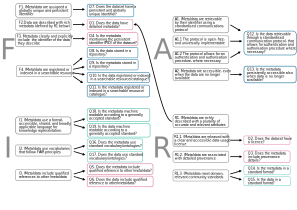

## Mapping of evaluation questions to FAIR principles 

As mentioned in [section 1.5](#evaluation), we based the questions of the evaluation tool related to the categories metadata, storage and standards directly on the FAIR principles. As shown in Figure \@ref(fig:Fig-mapping), each FAIR principle translates to one or more questions. Principles that are applicable to both data and metadata are split into separate questions.

```{r Fig-mapping, echo = FALSE, fig.align = 'center', fig.cap = "**Each of the FAIR principles (grey boxes) can directly be linked to one or more of the questions of our evaluation tool (coloured boxes, pink for metadata, blue for storage, green for standards).** The questions about structure are missing, as they are not directly derived from the FAIR principles.", dev = 'svg'}



```

<div>