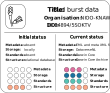
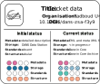
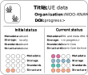

# Example datasets {#example-datasets} 
To illustrate the process of FAIRifying and structuring ecological data, we rely on several example datasets we used to develop this guide. These datasets were selected because they cover a broad variety of different structures and different levels of [FAIR](#FAIR), ranging from observational to experimental data and from highly unstructured and undocumented data to data that already fulfils some of the FAIR principles. 

:::{.infobox .infoimg}

For all example datasets we went through the full [workflow](#workflow) described in this guide, except the step of publishing the standardized and structured version of the data on a [repository](#repository). This is still work in progress, as we rely on datasets of others whose permission is needed for that. Without storing the data on a repository, many of the circles in the [evaluation](#evaluation) cannot be filled. In the following figures we therefore use solid circles for already fulfilled evaluation criteria and striped circles for criteria that will be fulfilled once the dataset is stored in a suitable repository.

:::

## Bud burst data {#budburst}
This dataset contains long-term data on the phenology of different tree species. Every year in spring, deciduous trees develop new leaves from their buds at a certain point in time. The timing of this can be crucial for herbivores, such as caterpillars, relying on newly emerging leaves as an important food source. To monitor shifts in tree phenology, the Department of Animal Ecology at NIOO-KNAW has assessed leaf development every year since 1988 by scoring the stage of bud opening on a fixed scale (cf. @Visser_2001). The data is stored on [DataverseNL](https://dataverse.nl/dataset.xhtml?persistentId=doi:10.34894/5SOKTV).  

```{r budburst, echo = FALSE, out.width = '50%', fig.cap = 'FAIR assessment of bud burst data. Striped circles indicate the hypothetical status of the dataset once it is stored in a repository (see note box above).', fig.align = 'center', dev = 'svg'}



```

## Cricket data {#cricket} 
This dataset contains experimental data on invertebrates belonging to the publication of @Vogels_2021. They tested whether changes in plant N:P ratios following sod-cutting constrain the reproductive potential in the European field cricket (*Gryllus campestris*). Different phosphorus and liming treatments were applied to vegetation plots in the heathlands of the Veluwe and the plants of these plots used in a feeding experiment in which the reproductive success of the female crickets was measured. The data is stored on the [DANS Data Station](https://lifesciences.datastations.nl/dataset.xhtml?persistentId=doi:10.17026/dans-zsa-f3y9).

```{r crickets, echo = FALSE, out.width = '50%', fig.cap = 'FAIR assessment of cricket data. Striped circles indicate the hypothetical status of the dataset once it is stored in a repository (see note box above).', fig.align = 'center', dev = 'svg'}



```

## CLUE field vegetation cover data (i.e., CLUE data) {#CLUE}
This dataset consists of data on vegetation cover collected in a long-term grassland biodiversity field experiment site in the Veluwe, Netherlands, also abbreviated as [CLUE fields](https://nioo.knaw.nl/en/facilities/clue-field-veluwe-database) (= changing land usage, enhancement of biodiversity and ecosystem development). Data collection started in 1996 and was done by the Department of Terrestrial Ecology of NIOO-KNAW. On a former agricultural field, experimental plots have been established in a random block design and different sowing treatments (i.e., high diversity, low diversity, continued agricultural rotation, and natural succession), as well as soil inoculation treatments have been applied in two different experiments in 1996. In both experiments, percent cover of each occurring plant species is measured annually. The data of both experiments resulted in two independent datasets. They are however very similar and their FAIRification process was nearly the same, so we treat them as one in this guide. 


```{r CLUE, echo = FALSE, out.width = '50%', fig.cap = 'FAIR assessment of CLUE data. Striped circles indicate the hypothetical status of the dataset once it is stored in a repository (see note box above).', fig.align = 'center', dev = 'svg'}



```
