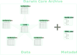

# (PART\*) d. Structure {.unnumbered}

# Structuring your standardised data

Research data comes in all different shapes and is by far not always structured or stored in an organised way. Reusing this data becomes much more difficult if no clear structure is detectable and easily leads to misinterpretations or misunderstanding of the data. By applying a data standard and thereby [standardising](#standardise) your column names, as is done with using Darwin Core, your data already becomes much more structured and understandable, as there have to be defined columns that can correspond with these terms. Darwin Core terms (or other data standards) can however be applied irrespective of the overall structure of your data, so the next step in making your data more [FAIR](#FAIR) is to also standardise the structure of your data.

Specifically tailored to Darwin Core, we present two options to structure your data in the following: a relational database and the Darwin Core Archive.

## Relational database

Relational databases are a common format in structuring your data files, where individual files are linked to each other by specific identifiers. This allows for a high flexibility in structuring your data and does as such not require your data to be in a standardised format. In Darwin Core several ID fields exist with which tables/files can be connected to each other, allowing the possibility to structure your standardised data as a relational database (Figure \@ref(fig:relational-database)).

In contrast to Darwin Core Archives (see Chapter Darwin Core Archive), relational databases can reduce redundancy in the data and are more flexible in linking information.

```{r relational-database, echo = FALSE, out.width = '100%', fig.cap = '**Relational database structure of Darwin Core files.** Arrows refer to the identifier through which two files are linked.', dev = 'svg'}


```

## Darwin Core Archive {#DarwinCore-Archive}

For biodiversity data that uses [Darwin Core](#DwC) terms, [Darwin Core Archives](#DwC-A) (DwC-A) are one standard format to organise your data, which is also required when you want to publish data on the aforementioned repositories [GBIF](#GBIF) and [OBIS](#OBIS).

There are four main components that together, bundled in one zip-folder, build the Darwin Core Archive:

-   the [core](#core) file

-   several [extension](#extension) files (optional)

-   an [EML](#eml) file (see [later section](#eml-terms))

-   a [meta XML](#metaxml) file (see [later section](#structural-metadata))

## The Core & its extensions

The core file is the central element of the archive to which each of the extension files has to be linked. Extensions can only be linked to the core and not to each other, resulting in a so-called star schema (see Figure \@ref(fig:star-schema)). This structure is heavily influenced by GBIF and is widely accepted but it has limited flexibility and partly leads to unnecessary redundancy in the data. A new version of GBIFs data model is currently (per June 2024) under development that aims to tackle this issue but that is not yet available, which is why we stick with the star schema for now. Both core and extensions contain one record per row and are linked by the core identifier.

```{r star-schema, echo = FALSE, out.width = '80%', fig.cap = 'Schematic of Darwin Core Archive. The data is structured into a core file and sourrounded by extension files in a star shaped manner. The data is accompanied by two metadata files. ', fig.align = 'center', dev = 'svg'}



```

### Find the core

The first step to build your archive therefore is to choose your core file. Which core to choose depends on the type of your data, which for biodiversity data is likely one of the following:

1.  Sampling event data: data contains information on ecological studies or monitoring programs, where the sampling is mostly quantitative, calibrated and according to certain protocols and with a documented sampling effort. → core file: [**Event**](#event)

2.  Checklist data: data contains information on annotated species checklists, taxonomic catalogues or other information about taxa. → core file: **Taxon**

3.  Occurrence data: data contains information on the evidence of an occurrence of a specific taxon either in nature, a collection or a datasets. This is the case if you have a list of species that occur at a particular place and a specific time but this was not measured by following a certain sampling protocol. → core file: [**Occurrence**](#occurrence)

### Occurrence core vs. event core

It is not always directly clear what the difference between the occurrence and the event core is and when you should use which of them. The most crucial difference between the two is whether the data was collected following a certain protocol with documented sampling effort. If that is the case, you have sampling event data and therefore an event core. If data collection did not follow a sampling protocol, your core will be the occurrence file. For measurements on individual specimens and museum collections in general, occurrence is however mostly the preferred core.

Most of the ecological data falls into sampling event data, as was the case for all of the datasets we used in the development of this guide. We will therefore focus on Event as the core file. If you have checklist data, there is already a detailed description on how to transform that into a Darwin Core Archive in the publication of @Reyershove.

## Which extension(s)?

Once you have determined your core and it is clear which information goes into it, you have to find one or more extensions if you need to store remaining information. The following extension files are possible:

-   **Event** (if event is not the core)

-   **Occurrence** (if occurrence is not the core)

-   **Taxon** (if taxon is not the core)

-   (extended) measurement or fact: The [**measurementOrFact**](#measurementorfact) file contains information on all the actual measurement values or facts that have been recorded for the records in the core file. The measurementOrFact file is always an extension file. There is also the **extendedMeasurementOrFact** extension, which is developed to be used with an event core and creates an additional link between the occurrence extension file and the measurements by including the occurrenceID next to the coreID (i.e. eventID).

-   **ResourceRelationship**: describes the relationships between resources in a Darwin Core Occurrence, Event, or Taxon Core to resources in an extension or external to the dataset

-   **Identification**: additional information on multiple identifications for species listed in Occurrence core

-   **dnaDerivedData**: DNA related data, used either with occurrence or event core

-   **Releve**: GBIF specific relevé file containing information on vegetation plot survey measurements; to be used together with event core and occurrence extension

-   **MaterialSample**

-   **Amplification**: information on DNA amplifications based on a schema from the Global Genome Biodiversity Network (GGBN)

-   **HumboldtEcologicalInventory**: information on ecological inventories related to event core

Based on our use cases with an event core, we recommend occurrence and extended measurement or fact as extension files for sampling event data, because this allows storing taxonomic information for every event, as well as all measured values.

