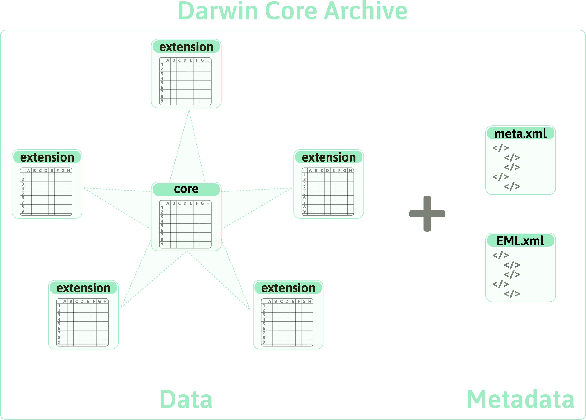

# Structuring your standardised data

Research data comes in all different shapes and is by far not always structured or stored in an organised way. Reusing this data becomes much more difficult if no clear structure is detectable and easily leads to misinterpretations or misunderstanding of the data. By applying a data standard and thereby [standardising](#standardise) your column names, as is done with using Darwin Core, your data already becomes much more structured and understandable, as there have to be defined columns that can correspond with these terms. Darwin Core terms (or other data standards) can however be applied irrespective of the overall structure of your data, so the next step in making your data more [FAIR](#FAIR) is to also standardise the structure of your data.

Specifically tailored to Darwin Core, we present two options to structure your data in the following: a relational database and the Darwin Core Archive.

## Relational database

Relational databases are a common format in structuring your data files, where individual files are linked to each other by specific identifiers. This allows for a high flexibility in structuring your data and does as such not require your data to be in a standardised format. In Darwin Core several ID fields exist with which tables/files can be connected to each other, allowing the possibility to structure your standardised data as a relational database (Figure \@ref(fig:relational-database)).

In contrast to Darwin Core Archives (see Chapter Darwin Core Archive), relational databases can reduce redundancy in the data and are more flexible in linking information.

```{r relational-database, echo = FALSE, out.width = '100%', fig.cap = '**Relational database structure of Darwin Core files.** Arrows refer to the identifier through which two files are linked.'}

knitr::include_graphics("images/DwC_relationalDatabase.png")

```

## Darwin Core Archive 

For biodiversity data that uses [Darwin Core](#DwC) terms, [Darwin Core Archives](#DwC-A) (DwC-A) are one standard format to organise your data, which is also required when you want to publish data on the aforementioned repositories [GBIF](#GBIF) and [OBIS](#OBIS).

There are four main components that together, bundled in one zip-folder, build the Darwin Core Archive:

-   the [core](#core) file

-   several [extension](#extension) files (optional)

-   an [EML](#eml) file (see later chapter)

-   a [meta XML](#metaxml) file (see later chapter).

## The Core & its extensions

The core file is the central element of the archive to which each of the extension files has to be linked. Extensions can only be linked to the core and not to each other, resulting in a so-called star schema (see Figure \@ref(fig:star-schema)). This structure is heavily influenced by GBIF and is widely accepted but it has limited flexibility and partly leads to unnecessary redundancy in the data. A new version of GBIFs data model is currently under development that aims to tackle this issue but that is not yet available, which is why we stick with the star schema for now. Both core and extensions contain one record per row and are linked by the core identifier.

```{r star-schema, echo = FALSE, out.width = '80%', fig.cap = 'Schematic of Darwin Core Archive. The data is structured into a core file and sourrounded by extension files in a star shaped manner. The data is accompanied by two metadata files. ', fig.align = 'center'}



```

### Find the core

The first step to build your archive therefore is to choose your core file. Which core to choose depends on the type of your data, which for biodiversity data is likely on of the following:

1.  Sampling event data: data contains information on ecological studies or monitoring programs, where the sampling is mostly quantitative, calibrated and according to certain protocols and with a documented sampling effort. → core file: [**Event**](#event)

2.  Checklist data: data contains information on annotated species checklists, taxonomic catalogues or other information about taxa. → core file: **Taxon**

3.  Occurrence data: data contains information on the evidence of an occurrence of a specific taxon either in nature, a collection or a datasets. This is the case if you have a list of species that occur at a particular place and a specific time but this was not measured by following a certain sampling protocol. → core file: [**Occurrence**](#occurrence)

### Occurrence core vs. event core

It is not always directly clear what the difference between the occurrence and the event core is and when you should use which of them. The most crucial difference between the two is whether the data was collected following a certain protocol with documented sampling effort. If that is the case, you have sampling event data and therefore an event core. If data collection did not follow a sampling protocol, your core will be the occurrence file. For measurement on individual specimens and museum collections in general, occurrence is however mostly the preferred core.

Most of the ecological data falls into sampling event data, as was the case for all of the data sets we used in the development of this guide. We will therefore focus on Event as the core file. If you have checklist data, there is already a detailed description on how to transform that into a Darwin Core Archive in the publication of @Reyershove.

## Which extension(s)?

Once you have determined your core and it is clear which information goes into it, you have to find one or more extensions if you need to store remaining information. The following extension files are possible:

-   **Event** (if event is not the core)

-   **Occurrence** (if occurrence is not the core)

-   **Taxon** (if taxon is not the core)

-   (extended) measurement or fact: The [**measurementOrFact**](#measurementorfact) file contains information on all the actual measurement values or facts that have been recorded for the records in the core file. The measurementOrFact file is always an extension file. There is also the **extendedMeasurementOrFact** extension, which is developed to be used with an event core and creates an additional link between the occurrence extension file and the measurements by including the occurrenceID next to the coreID (i.e. eventID).

-   **ResourceRelationship**: describes the relationships between resources in a Darwin Core Occurrence, Event, or Taxon Core to resources in an extension or external to the dataset

-   **Identification**: additional information on multiple identifications for species listed in Occurrence core

-   **dnaDerivedData**: DNA related data, used either with occurrence or event core

-   **Releve**: GBIF specific relevé file containing information on vegetation plot survey measurements; to be used together with event core and occurrence extension

-   **MaterialSample**

-   **Amplification**: information on DNA amplifications based on a schema from the Global Genome Biodiversity Network (GGBN)

-   **HumboldtEcologicalInventory**: information on ecological inventories related to event core

Based on our use cases with an event core, we recommend occurrence and extended measurement or fact as extension files for sampling event data, because this allows storing taxonomic information for every event, as well as all measured values.

## Arrange Darwin Core terms in core and extension files

In the Darwin Core Archive the Darwin Core terms are sorted into the different files, each having terms that are required and some that we highly recommend to use, while others are optional additions. Generally, every extension file needs to contain the core identifier of the core file. For example, if you have an event core, the core ID is the field "eventID" and every extension file therefore needs to have the column eventID, linking records to the records in the core. In the following we provide an overview which terms can be included in which file. This is based on the documentation in the [GBIF schema repository](https://rs.gbif.org/extensions.html). Additionally we indicate which terms we view as required to have in each file and which we strongly recommend, adapted from the data quality requirements of GBIF for each data type ([Sampling event](https://www.gbif.org/data-quality-requirements-sampling-events), [occurrence](https://www.gbif.org/data-quality-requirements-occurrences), [checklist](https://www.gbif.org/data-quality-requirements-checklists) data).

### General terms (Terms of class Record-level)

There are terms that can always be included in the core-file, independent of what the core is. Those are record-level terms, which are generic and can apply to any type of records in the data. The content of these terms can be considered [metadata](#metadata), which is why it is likely that you do not have corresponding columns in your data yet but need to create new columns. Many of these terms are from the [Dublin Core](#dublincore) namespace and few come with a fixed vocabulary to use to fill them.

The following terms can be useful to add, while none of them are required:

-   type: to be filled with one of the terms in the DCMI type vocabulary

-   language: use controlled vocabulary, such as the ISO language code

-   licence: see section "licencing"

-   rightsHolder

-   accessRights

-   bibliographicCitation: should provide clear information on how to cite the resource itself

-   references

-   institutionCode, institutionID

-   datasetID

-   basisOfRecord: best practise is to use controlled vocabulary, such as the names of the Darwin Core classes:

    -   MaterialEntity, PreservedSpecimen, FossilSpecimen, LivingSpecimen, MaterialSample, Event, HumanObservation, MachineObservation, Taxon, Occurrence, MaterialCitation

### Event file

The event file can include the following terms:

-   all terms of the class Event
-   all terms of the class Location
-   all terms of the class GeologicalContext

:::{.sortTermsBox}
<span style="color: #d111d4ff;">**Required**:</span>

- <span style="color: #d111d4ff;">eventID</span>

- <span style="color: #d111d4ff;">eventDate</span>

- <span style="color: #d111d4ff;">samplingProtocol</span>

- <span style="color: #d111d4ff;">sampleSizeValue & sampleSizeUnit</span> 


<span style="color: #dd7f08ff;">**Recommended**:</span>

- <span style="color: #dd7f08ff;">parentEventID (if applicable)</span>

- <span style="color: #dd7f08ff;">samplingEffort</span>

- <span style="color: #dd7f08ff;">decimalLatitude & decimalLongitude & geodeticDatum</span>

- <span style="color: #dd7f08ff;">coordinateUncertaintyInMeters</span>

- <span style="color: #dd7f08ff;">countryCode</span>

:::

### Occurrence file

All of the terms that can be included in the event file can also be included in the occurrence file. The occurrence file is however more flexible and additionally allows for more terms. You can additionally include:

- all terms of the class Occurrence
- all terms of the class Organism
- all terms of the class Taxon
- all terms of the class Identification

:::{.sortTermsBox}
<span style="color: #d111d4ff;">**Required**:</span>

- <span style="color: #d111d4ff;">scientificName</span>

- <span style="color: #d111d4ff;">occurrenceStatus</span>

- <span style="color: #d111d4ff;">basisOfRecord</span>

- <span style="color: #d111d4ff;">occurrenceID</span>


<span style="color: #dd7f08ff;">**Recommended**:</span>

- <span style="color: #dd7f08ff;">taxonRank</span>

- <span style="color: #dd7f08ff;">kingdom (or other higher taxonomy)</span>

- <span style="color: #dd7f08ff;">decimalLongitue & decimalLatitude & geodeticDatum</span>

- <span style="color: #dd7f08ff;">coordinateUncertaintyInMeters</span>

- <span style="color: #dd7f08ff;">countryCode</span>

- <span style="color: #dd7f08ff;">individualCount or organismQuantity & organismQuantityType</span>

:::

### Taxon file

The taxon file only contains the record-level terms and all terms of the class taxon. 

:::{.sortTermsBox}
<span style="color: #d111d4ff;">**Required**:</span> 

- <span style="color: #d111d4ff;">taxonID</span>

- <span style="color: #d111d4ff;">scientificName</span>

- <span style="color: #d111d4ff;">taxonRank</span>


<span style="color: #dd7f08ff;">**Recommended**:</span>

- <span style="color: #dd7f08ff;">kingdom (or other higher taxonomy)</span>

- <span style="color: #dd7f08ff;">parentNameUsageID</span>

- <span style="color: #dd7f08ff;">acceptedNameUsageID</span>

:::

### MeasurementOrFact file

The MeasurementOrFact file is linked to the core by including the coreID and besides that can only include the terms of the class MeasurementOrFact, while no terms of other classes should be included. The extendedMeasurementOrFact extension additionally contains the occurrenceID and three ID fields (measurementTypeID, measurementValueID, measurementUnitID) which are however not from the Darwin Core namespace but refer to OBIS. As their [IRIs](#URI) are not resolvable, we would not recommend using them. 