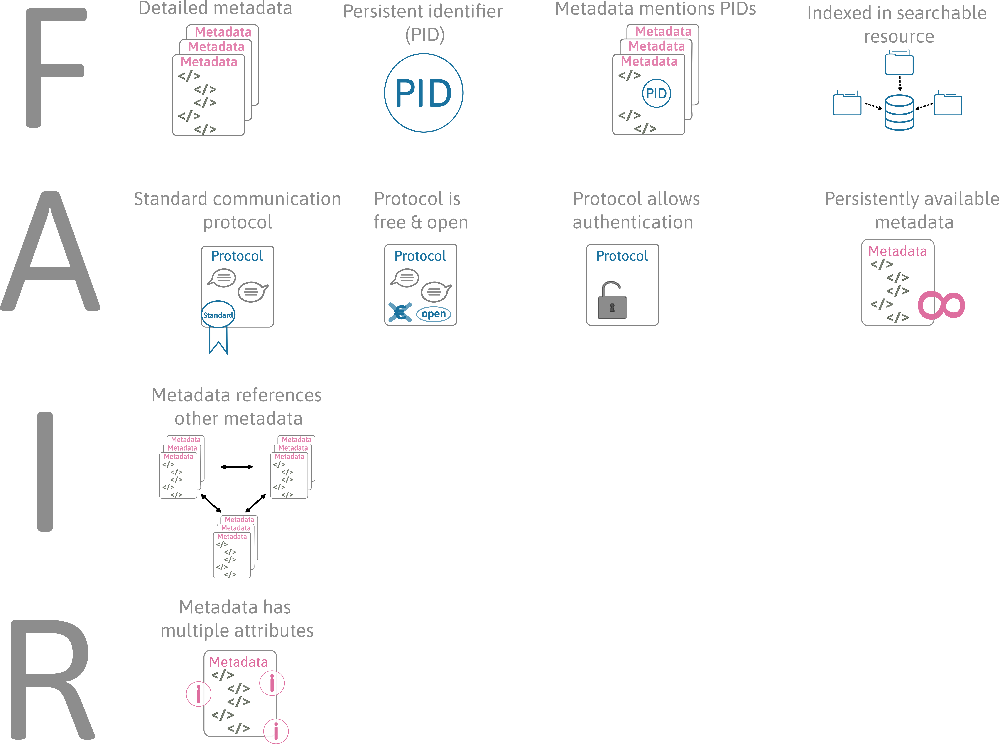

# Introduction

## What is FAIR?

Research data often is stored on local hard drives, not well described or not formatted in a consistent and standard way. This makes it very difficult for others (and often even for the data owner themselves) to reuse the data or reproduce the research, because the data is not straightforward to understand, cannot be interpreted correctly, or, in case of local storage, might be unknown to others. In order to change this and increase the reusability of data, @Wilkinson_2016 introduced the FAIR concept together with 15 guiding principles providing guidance on how to implement it. FAIR stands for **F**indable, **A**ccessible, **I**nteroperable and **R**eusable, which more concrete means the following:

**Findable.** This means that the [metadata](#metadata) (and the data) can be easily found by humans and computers and that machine-readable metadata allows for automatic discovery of the data by machines.
  
**Accessible.** It is clearly stated how the user can access the data and whether, for example, authorisation or authentication are required.

**Interoperable.** In order to integrate the data with other data and to incorporate it into workflows or applications, the data needs to be fully compatible with other data. In easier words this means that data resources should 'speak the same language' to be used together.

**Reusable.** The ultimate goal of the FAIR concept is to make the data reusable, which means that there is proper annotation in the form of metadata that allows users (and machines) to understand the data and correctly interpret it.

(\#fig:FAIR)**The FAIR concept.** The four letters of FAIR stand for findable, accessible, interoperable and reusable and come with 15 guiding principles.

## Extending FAIR

In our guide we will extend FAIR as it would be strictly defined by the FAIR principles in order to make it workable in practice. This means that we also include the component of structuring your data into the process of FAIRifying it.

**Structured.** Structuring your data, so organising it in a tidy way, can clearly make the data easier to access for others and enhances its understandability. We therefore think that this is a crucial component of increasing the reusability of your data.

## FAIR is not open

It is important to stress here that FAIR is **not equal** to open. While the metadata of your data should be openly available, informing others about the existence of your data, the data itself does not have to be open. If you have reasons for not making the data openly available to everyone (e.g., because it contains sensitive information), this can and should be made clear in the metadata where according licensing information and access rights can be provided. As long as this is guaranteed, restricted or closed data can also be completely FAIR.

## Why should your data be FAIR?

Depending on the current maturity of your data, making data FAIR certainly requires some effort, but the benefits are evident both for yourself and for others. Findable and well annotated data facilitates your own reuse of your data in the future and the reuse of your data by others, which simultaneously increases the visibility and the impact of your research. Increasing the interoperability of the data additionally increases the possibilities for collaborations and will in total benefit the scientific community.
