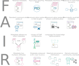

# (PART\*) - I. Background - {.unnumbered}

# Introduction 

## What is FAIR?

Research data often is stored on local hard drives, not well described or not formatted in a consistent and standard way. This makes it very difficult for others (and often even for the data owner themselves) to reuse the data or reproduce the research, because the data is not straightforward to understand, cannot be interpreted correctly, or, in case of local storage, might be unknown to others. In order to change this and increase the reusability of data, @Wilkinson_2016 introduced the FAIR concept together with 15 guiding principles providing guidance on how to implement it. FAIR stands for **F**indable, **A**ccessible, **I**nteroperable and **R**eusable, which more concrete means the following:

**Findable** means that the [metadata](#metadata) and the data can be easily found by both humans and computers, and that machine-actionable metadata allows for discovery of the data by machines. When you present data in a relevant repository and make sure that they are described with thorough and relevant metadata, you make it possible for others to find them.
  
**Accessible** means that there is information on how humans or computers gain access to the data. This does not mean that the data have to be openly available for everyone (see [FAIR is not open](#fair-is-not-open)), but that the freely available metadata clearly indicates to both humans and computers how and under what conditions data can be retrieved. 

**Interoperable** means that (meta)data can be integrated with other (meta)data, and that (meta)data can be exchanged and used across different systems. In other words, data resources should 'speak the same language' to be used together.

**Reusable** means that data are sufficiently annotated and curated so that others – humans and machines – can understand the context and methods of data collection, correctly interpret the meaning of the data, and accurately reuse the data.

(\#fig:FAIR)**The FAIR concept.** The four letters of FAIR stand for findable, accessible, interoperable and reusable and come with 15 guiding principles.

The 15 guiding principles describe different elements or characteristics of datasets that can be adhered to in different combinations – partly through the distinction between data and metadata – and to different maturity levels (see also [FAIR Data Maturity Model. Specification and Guidelines of RDA](https://zenodo.org/records/3909563)). As a result, datasets can vary widely in their FAIRness level and datasets that have the same overall level of FAIRness may differ in the components of FAIR they adhere to.

:::{.infobox .infoimg}

For an entertaining but serious description of the FAIR principles and their meaning, we recommend reading “*A FAIRy tale - A fake story in a trustworthy guide to the FAIR principles for research data*” created within the Danish ‘FAIR across’ (FAIR på tværs) project: https://forskningsdata.dk/fairytale/ (@FAIRy_tale).

:::

## Adding structure to FAIR

In this guide we extend FAIR as it is defined by the FAIR principles in order to make it workable in practice. This means that we include the component of structuring your data into the FAIRification process. **Structuring** your data, i.e., organising it in a tidy way, can make the data easier to access for others and enhances its understandability. We therefore think that this is a crucial component of increasing the reusability of your data. 

## FAIR is not open {#fair-is-not-open}

It is important to emphasise that FAIR is **not equal** to open. While the metadata of your data should be openly available to enable the discovery of your data by others, the data itself does not have to be open. If you have reasons for not making the data openly available to everyone (e.g., because it contains sensitive information), this can and should be made clear in the metadata where according licensing information and access rights can be provided. As long as this is guaranteed, restricted or closed data can also be completely FAIR. 

## Why should you make your data more FAIR?

Depending on the current status of your data, making data FAIR certainly requires some effort, but the benefits are evident both for yourself and for others. Findable and well-annotated data facilitates your own reuse of your data in the future and the reuse of your data by others, which simultaneously increases the visibility and the impact of your research. Increasing the interoperability of your data additionally increases the possibilities for collaborations, as your data can be integrated with other data, and hence will benefit the scientific community as a whole. 
