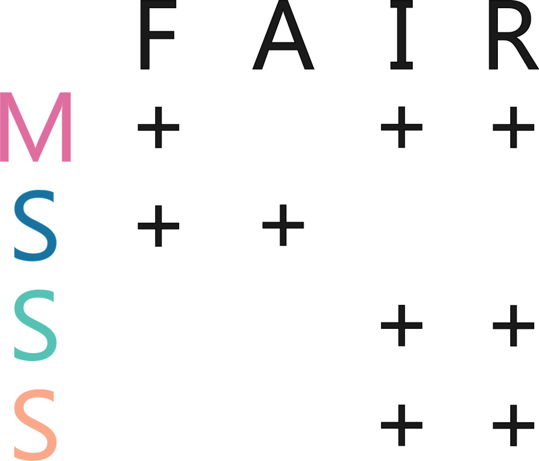

## FAIR assessment of your data

As stated before, every dataset is different and datasets can vary widely in their level of FAIR. FAIR is a gradient (see also [FAIR Data Maturity Model. Specification and Guidelines of RDA](https://zenodo.org/records/3909563)) and different datasets can fulfil different criteria of FAIR but reach the same overall level of FAIRness. It is therefore important to first assess which state your data is in and what steps your data need to be improved. There are already a range of FAIR assessment tools (see [here](https://fairassist.org/) for an overview), which score your data but there is much less guidance on how to actually improve the FAIRness of your data. Next to questionnaire-based assessment tools, there are also tools available that automatically assess the FAIRness of your data. Most of them however require the data to be already stored on an online repository, which is not the state at which we want to start with our FAIR assessment.

We therefore developed our own tool that provides you with a set of simple questions about four properties of your data: **metadata**, **storage**, **standards** and **structure**.

**Metadata** is data about your data and contains information about the who, where, what, when and how of data collection allowing another user of your data to understand and reuse it without prior knowledge of the data.

**Storage** is about whether your data is stored persistently and in a way that makes it findable and accessible to others.

**Standards** describe uniform, community-accepted formats in which both data and metadata are stored and which enhance compatibility with other datasets.

**Structure** is about whether your data is organised in a consistent and logical way.

Besides the questions about structure, they are all directly based on the FAIR principles. Figure 2 visualises how the data properties in the assessment link to the letters of FAIR. Your answers will provide you with a circle-diagram showing how mature your dataset is in each of the properties and connected to that a list of chapters of this manual you can work through to further improve the maturity of your data.

(\#fig:unnamed-chunk-1)Link between data properties and FAIR. The letters on the left stand for the data properties used in the FAIR assessment (metadata, storage, standard, structure). Each plus indicates that the data property improves the maturity of each of the respective letter of FAIR. A blanc space means that this data property has no direct influence on the respective letter of FAIR.

It will likely be difficult to reach the full score in all of the properties of your data, but this also not necessarily the aim of this assessment or guide. Every improvement is already a great step! Especially the components that link to interoperability are more difficult to implement, as true interoperability generally is a big challenge within and across disciplines (@Pagano_2013). One step to reach interoperability is to use a language for knowledge representation and linked data, such as [RDF (Resource Description Framework)](#RDF). However, as this is more the expertise of data or information scientists instead of ecologists, we will not look into these topics in this guide. 
