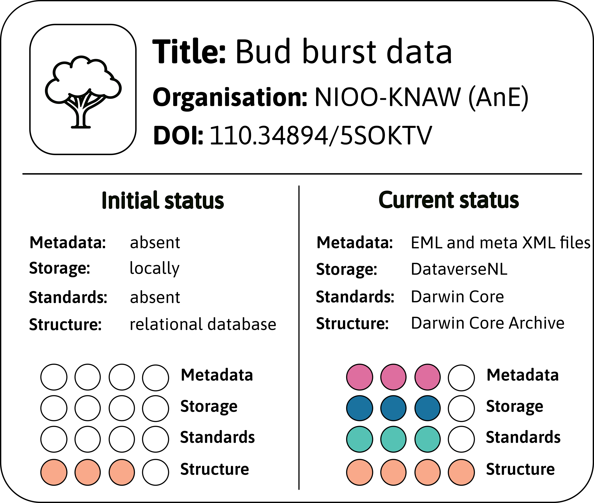
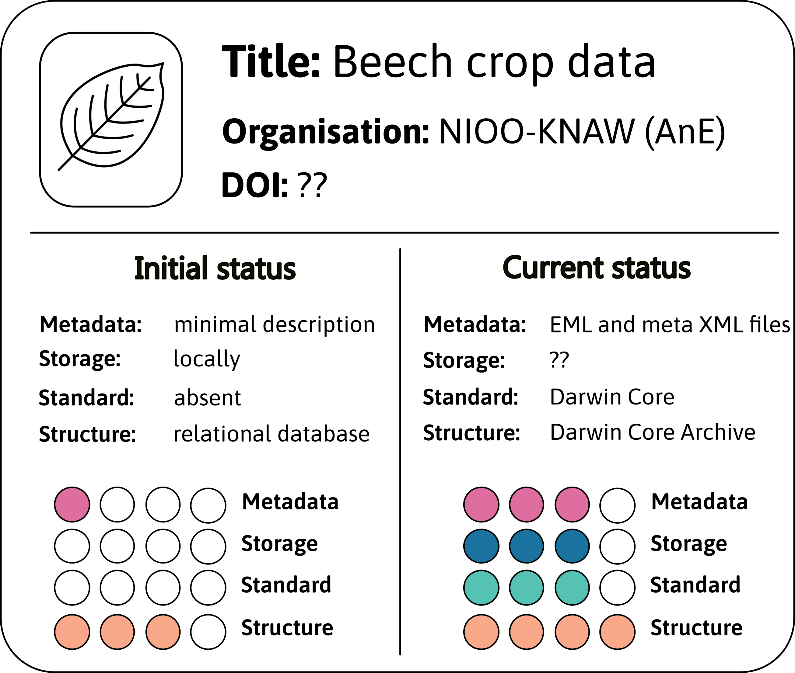
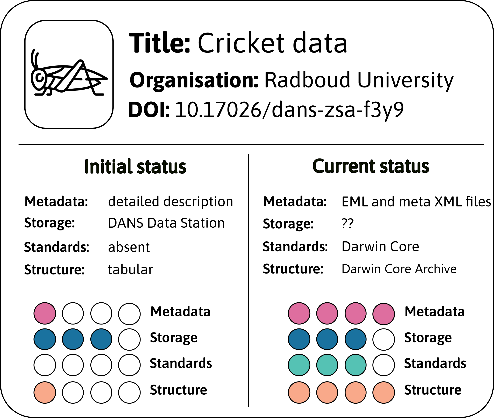
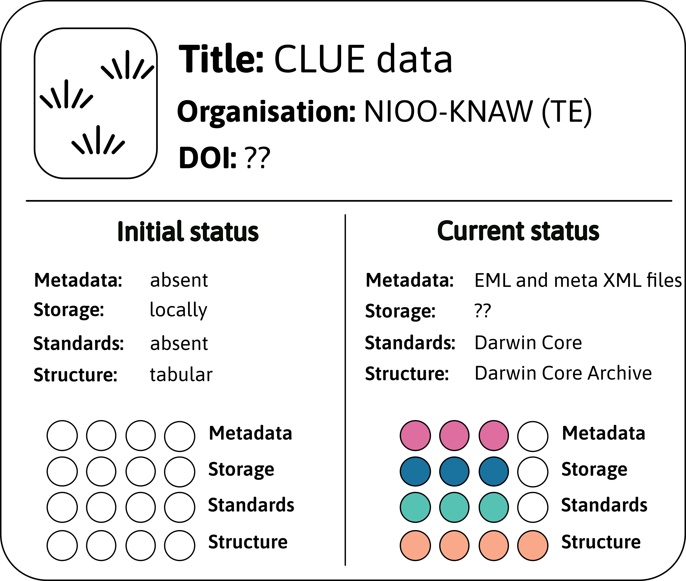

# Example data sets {#example-datasets}
To illustrate the process of FAIRifying ecological data we will rely on several example data sets we used to develop this guide. These data sets were selected because they cover a broad variety of different structures and different levels of [FAIR](#FAIR), ranging from observational to experimental data and from highly unstructured and undocumented data to data that already fulfils some of the FAIR principles. 

## Bud burst data {#budburst}
The first dataset contains long-term data on the phenology of different tree species. Every year in spring, deciduous trees develop new leaves from their buds at a certain point in time. The timing of this can be crucial for herbivores, such as caterpillars, relying on newly emerging leaves as an important food source. To monitor shifts in tree phenology, the Department of Animal Ecology at NIOO has assessed leaf development every year since 1988  by scoring the stage of bud opening on a fixed scale (cf. @Visser_2001). 

(\#fig:budburst)FAIR assessment of bud burst data.

## Beech crop data {#beechcrop} 
A second data set collected by Animal Ecology/NIOO contains data on the amount of beech mast per year since 1976. Low, intermediate and high seed production in beech (Fagus sylvatica) trees alternate periodically over years. Since beech nuts are an important winter food resource for several species, such as passerine birds, seed availability is monitored yearly by collecting beech nuts in determined grids under a set of trees. These nuts are counted and weighted and based on this a so-called beech crop index can be calculated (cf. @Perdeck_2000). 

(\#fig:beechcrop)FAIR assessment of beech crop data.

## Cricket data {#cricket}
The third data set contains experimental data on invertebrates belonging to the publication of @Vogels_2021. They tested whether changes in plant N:P ratios following sod-cutting constrain the reproductive potential in the European field cricket (Gryllus campestris). Different phosphorus and liming treatments were applied to vegetation plots in the heathlands of the Veluwe and the plants of these plots used in a feeding experiment in which the reproductive success of the female crickets was measured. 

(\#fig:crickets)FAIR assessment of cricket data.

## CLUE field vegetation cover data (i.e., CLUE data) {#CLUE}
The last example dataset consists of data on vegetation cover collected in a long-term grassland biodiversity field experiment site in the Veluwe, Netherlands, also abbreviated as [CLUE fields](https://nioo.knaw.nl/en/facilities/clue-field-veluwe-database) (= changing land usage, enhancement of biodiversity and ecosystem development). Data collection started in 1996 and was conducted by the Department of Terrestrial Ecology of NIOO-KNAW. On a former agricultural field, experimental plots have been established in a random block design and different sowing treatments (high diversity, low diversity, continued agricultural rotation, and natural succession), as well as soil inoculation treatments have been applied in two different experiments in 1996. In both experiments, percent cover of each occurring plant species is measured annually. The data of both experiments result in two independent datasets, they are however very similar and their FAIRification process was nearly the same so that they will be treated as one dataset, called CLUE data, in the following. 

(\#fig:CLUE)FAIR assessment of CLUE data.

