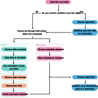

# (PART\*) - II. How-to chapters - {.unnumbered}

# Workflow
 
The general workflow of making your data more [FAIR](#FAIR) and structured is shown in Figure \@ref(fig:workflow) and shortly described in the following section.

To make your data more FAIR and structured, we recommend you to take the following steps:

-   Describe your data and thereby gather [metadata](#metadata)

-   You should decide whether your raw data should be [mobilised](#mobilisation) to an online [repository](#repository)

    -   If yes, you have to choose a suitable repository and upload your metadata and data there
    

-  Start to [standardise](#standardise) both the data and the metadata. With which of the two you start does not matter, as they can both be structured and standardised separately

For the metadata:

-   Choose a metadata standard

-   Map the metadata to the selected standard

For the data:

-   Choose a suitable data standard

-   Map the data to that standard

-   For further standardisation of your data, use ontologies and biological taxonomies where possible to describe the contents of the data

-   Choose a standardised structure for the data

-   Restructure your data according to the chosen structure

-   Once standards and structure are applied, structural metadata can be created that describes how the data is organised in its new form

As a last step, your standardised data and metadata should be persistently stored in an online storage
If you have not chosen a repository before (or if you want to store the standardised data elsewhere), you should:

-   Choose a suitable repository that accepts your new data structure/format

-   Mobilise the data and the metadata to the chosen repository

You can enter this workflow at any point, depending on the status of your data, and it might be necessary to go back and forth between some of the steps.

Even though this guide is tailored to ecological data, the workflow presented here should be generally applicable to any type of data, only the implementations of each step will differ.
In the following chapters, we will go through each of the steps and provide some general background, introduce some options for implementation for ecological data and considerations that can help to choose the best suited option for your data, as well as a short insight into our own choices for the [example datasets](#example-datasets).

(\#fig:workflow)Diagram of the workflow presented in this guide to FAIRify data.

